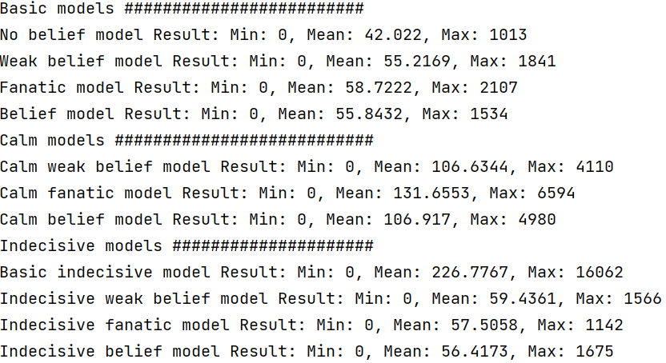

# CoinFlipCheatersModels
These are some models I made for the [coin flip cheaters](https://www.youtube.com/watch?v=QC91Bf8hQVo)

## Analysis
There are two types of coins in the problem.
1. fair coin (probability of heads is 1/2)
2. biased coin (probability of heads is 3/4)

Using Bayes' theorem, one can find the probability of the coin to be fair. 

Let $n$ be the number of coin flips, $X$ be the number of heads, $p_{fair} = \dfrac{1}{2}$, $p_{cheat} = \dfrac{3}{4}$, and $p_{coin} = \dfrac{1}{2}$. Note that $p_{coin}$ means the probability of the coin to be fair without any observations. We can find that $X \sim B(n, p_{fair})$ if the coin is fair, and $X \sim B(n, p_{cheat})$ otherwise. Then, if $x$ of heads were observed from $n$ trials, by Bayes' theorem, we get

$$ fairness := P(\text{The coin is fair}|X = x) = \dfrac{b(x; n, p_{fair})p_{coin}}{b(x; n, p_{fair})p_{coin} + b(x; n, p_{cheat})(1 - p_{coin})} $$

where $b(x; n, p)$ is the probability mass function of the binomial distribution. Since $ P(\text{The coin is unfair}|X = x) = 1 - fairness$, if $fairness > \dfrac{1}{2}$, we can conclude that the coin is more likely to be fair. Otherwise, we may conclude that the coin is more likely to be biased.

If we label right, we get 1 point and 15 flipping chances. Otherwise we lose 30 flipping chances. Let's consider only the flipping chances. If we flip once, we lose 1 flipping chance. We may gain or lose flipping chances by labeling. Thus, we can evaluate the labeling process by below formula.

$$ reward := \begin{cases}
15 \ \ \ \ \ \text{if the label is correct} \\
-30 \ \ \ \ \ \text{o.w.}
\end{cases}$$

$$ \mathbb{E}[reward] = P(\text{the label is correct}) \times 15 + P(\text{the label is incorrect}) \times (-30) - n $$

For my model, I used $fairness$ for labeling. As mentioned above, if $fairness > 0.5$ the model label the coin as fair. Otherwise cheat. To calculate $fairness$ we need the number of flips, again $n$, and the number of heads, $x$. Therefore, the formula above can be written as below.

$$ \mathbb{E}[reward(n, x)] = \begin{cases}
fairness \times 15 + (1 - fairness) \times (-30) - n \ \ \ \ \ \text{if } fairness > 0.5 \\
(1 - fairness) \times 15 + fairness \times (-30) - n \ \ \ \ \ \text{o.w.}
\end{cases}
$$

From above, we can calculate the expected reward. If there is a way that maximizes the expected reward, we can take that as a strategy.

## Basic Models
### No Belief Model
The no belief model tests a coin until the 'generally' expected reward is at its maximum. What I meant by the term generally is that it does not consider **how many times we got heads**.

$$ \mathbb{E}[reward(n)] = \Sigma_{x = 0}^{n} P(X = x) reward(n, x) $$

Suppose that $n = n^\*$ maximizes $reward(n)$. Then, the simple model flips the coin while $n < n^\*$, and finish testing if there is no flipping chance ramining, $n >= 14$, or $n >= n^\*$. The condition $n >= 14$ is naturally inducted from the fact that $reward <= 15$.

For $P(X = x)$, we use the law of total probability.

$$ \begin{align*} 
P(X = x) &= P(X = x \cap \text{The coin is fair}) + P(X = x \cap \text{The coin is unfair}) \\
&= p_{coin}b(x; n, p_{fair}) + (1 - p_{coin})b(x; n, p_{cheat}) 
\end{align*} $$

### Weak Belief Model
The weak belief model tests a coin while the expected reward increases. Which means that we compare below two values.

1. $$ \mathbb{E}[reward(n, x)] $$
2. $$ P(\text{The next coin is head}) \times reward(n + 1, x + 1) + P(\text{The next coin is tail}) \times reward(n + 1, x) $$

If the first value is greater than the second value, the reward expected to be decreased, thus we label the coin instantly. Otherwise, the reward expected to be increased, thus we flip once more.

To calculate the second value, we use the law of total probability, and use $p_{coin}$ for estimating the probability of the coin to be fair; it does not use any posterior observation data.

$$ \begin{align*} 
P(\text{The next coin is head}) &= P(\text{The coin is fair} \cap \text{The next coin is head}) + P(\text{The coin is unfair} \cap \text{The next coin is tail}) \\
&= p_{coin}p_{fair} + (1 - p_{coin})p_{cheat}
\end{align*} $$

We can calculate $P(\text{The next coin is tail})$ as $1 - P(\text{The next coin is head})$.

### Fanatic Model
The fanatic model is similar to the weak belief model, except that it considers the 'current' label. As mentioned above, the coin can be labeled by using $fairness$. Because we have the number of flips and the number of heads, we can pre-label the coin as fair or cheat. We can use the pre-label to calculate the expected reward, instead of using the law of total probability. In formula,

$$ P(\text{The next coin is head}) = \begin{cases}
p_{fair} \ \ \ \ \ \text{if } fairness > 0.5 \text{ for } n, x \\
p_{cheat} \ \ \ \ \ \text{o.w.}
\end{cases} $$

This model strongly depends on the posterior observation data, not considering the prior probability.

### Belief Model
The belief model is also simliar to the weak belief model, except that it considers $fairness$. The weak belief model estimates the probability of coin being fair to be $p_{coin}$. Instead, we may use $fairness$ since it also uses posterior observation data, expected to give better results. In formula,

$$ \begin{align*} 
P(\text{The next coin is head}) &= P(\text{The coin is fair} \cap \text{The next coin is head}) + P(\text{The coin is unfair} \cap \text{The next coin is tail}) \\
&= fairness \times p_{fair} + (1 - fairness) \times p_{cheat}
\end{align*} $$

## Calm Models
There is huge uncertainty whether the coin is fair or biased, if the model met the end condition for the first time. Therefore calm models do not end testing if the end condition (the reward is expected to be decreased) is first met. When the end condition is again met, they end testing. If the remaining fund is 0 or it is 14th flip, it ends testing, since there is no more chances to flip.

## Indecisive Models
If there is huge uncertainty, it would be better to minimize the uncertainty. Thus, indecisive models uses significance level to label the coin. If fairness of coin is enoughly small or large that the model is certain that it is fair or biased, it label the coin.

### Basic Indecisive Model
As mentioned above, indecisive model uses significance level to check the end condition. If

$$ fairness < significance_level \lor fairness > 1 - significance_level $$

The model thinks that the coin is *certainly* fair or biased. Empirically significant level of 0.3 worked fine.

### Indecisive Other Models
For computing expected next reward, other than considering only for the next step, indecisive models consider every combinations that can occur. When considering every combinations, it computes expected reward if given fairness(n + k, x + l) (k for future flips, l for future heads) is signficant, and search further if given fairness is not significant.

## Model Result (After 10000 simulations)

## Cheat Sheet
### Fanatic Model
Below is the cheat sheet built using fanatic model. F for Fair, C for Cheat, T for further testing.

| $n$ | $x$ | $0$ | $1$ | $2$ | $3$ | $4$ | $5$ | $6$ | $7$ | $8$ | $9$ | $10$ | $11$ | $12$ | $13$ | $14$ | $15$ |
| :-: | :-: | :-: | :-: | :-: | :-: | :-: | :-: | :-: | :-: | :-: | :-: | :--: | :--: | :--: | :--: | :--: | :--: |
| $0$ | | T |
| $1$ | | F | T |
| $2$ | | F | T | C |
| $3$ | | F | F | T | C |
| $4$ | | F | F | F | T | C |
| $5$ | | F | F | F | T | C | C |
| $6$ | | F | F | F | F | T | C | C |
| $7$ | | F | F | F | F | T | T | C | C |
| $8$ | | F | F | F | F | F | T | C | C | C |
| $9$ | | F | F | F | F | F | F | T | C | C | C |
| $10$ | | F | F | F | F | F | F | T | C | C | C | C |
| $11$ | | F | F | F | F | F | F | F | T | C | C | C | C |
| $12$ | | F | F | F | F | F | F | F | F | T | C | C | C | C |
| $13$ | | F | F | F | F | F | F | F | F | T | C | C | C | C | C |
| $14$ | | F | F | F | F | F | F | F | F | F | C | C | C | C | C | C |
| $15$ | | F | F | F | F | F | F | F | F | F | F | C | C | C | C | C | C |

### Basic Indecisive Model
Below is the cheat sheet built using basic indecisive model. F for Fair, C for Cheat, T for further testing.

| $n$ | $x$ | $0$ | $1$ | $2$ | $3$ | $4$ | $5$ | $6$ | $7$ | $8$ | $9$ | $10$ | $11$ | $12$ | $13$ | $14$ | $15$ |
| :-: | :-: | :-: | :-: | :-: | :-: | :-: | :-: | :-: | :-: | :-: | :-: | :--: | :--: | :--: | :--: | :--: | :--: |
| $0$ | | T |
| $1$ | | T | T |
| $2$ | | F | T | T |
| $3$ | | F | F | T | C |
| $4$ | | F | F | T | T | C |
| $5$ | | F | F | F | T | C | C |
| $6$ | | F | F | F | F | T | C | C |
| $7$ | | F | F | F | F | T | T | C | C |
| $8$ | | F | F | F | F | F | T | C | C | C |
| $9$ | | F | F | F | F | F | T | T | C | C | C |
| $10$ | | F | F | F | F | F | F | T | T | C | C | C |
| $11$ | | F | F | F | F | F | F | F | T | C | C | C | C |
| $12$ | | F | F | F | F | F | F | F | T | T | C | C | C | C |
| $13$ | | F | F | F | F | F | F | F | F | T | C | C | C | C | C |
| $14$ | | F | F | F | F | F | F | F | F | F | C | C | C | C | C | C |
| $15$ | | F | F | F | F | F | F | F | F | F | F | C | C | C | C | C | C |

## Note on the game balance
By the way, the game is well designed. The 'generally' expected rewards are calculated as below.

| $n$ | $0$ | $1$ | $2$ | $3$ | $4$ | $\cdots$ | $14$ | $15$ |
| :-: | :-: | :-: | :-: | :-: | :-: | :------: | :--: | :--: |
| $\mathbb{E}[reward(n)]$ | $-7.500$ | $-2.875$ | $-2.469$ | $-2.766$ | $-1.920$ | $\cdots$ | $-6.282$ | $-6.733$ |

The expected rewards are all negative, thus somehow the game would end eventually. If we modify $p_{coin} = \dfrac{1}{4}$, then we get

| $n$ | $0$ | $1$ | $2$ | $3$ | $4$ | $\cdots$ | $14$ | $15$ |
| :-: | :-: | :-: | :-: | :-: | :-: | :------: | :--: | :--: |
| $\mathbb{E}[reward(n)]$ | $-18.750$ | $2.750$ | $2.453$ | $1.629$ | $1.552$ | $\cdots$ | $-4.738$ | $-5.327$ |

Some expected rewards are positive. If we do only few tests, the flipping chance is expected to be gained. Therefore, the game would be super long, or even endless, and become boring. Fix $p_{coin} = \dfrac{1}{2}$ and modify $p_{cheat} = \dfrac{9}{10}$. Then we get

| $n$ | $0$ | $1$ | $2$ | $3$ | $4$ | $\cdots$ | $14$ | $15$ |
| :-: | :-: | :-: | :-: | :-: | :-: | :------: | :--: | :--: |
| $\mathbb{E}[reward(n)]$ | $7.500$ | $0.500$ | $3.100$ | $2.720$ | $3.948$ | $\cdots$ | $-0.638$ | $-1.619$ |

Again, some expected rewards are positive. 

Still, we can modify some parameters to make different games. We can lower $p_{cheat}$ instead of making it higher. Or higher $p_{cheat}$ slightly. We may modify the reward if it is not enoughly large to make some expected rewards positive. Modifying $p_{coin}$ can be done either, if it is modified carefully.
